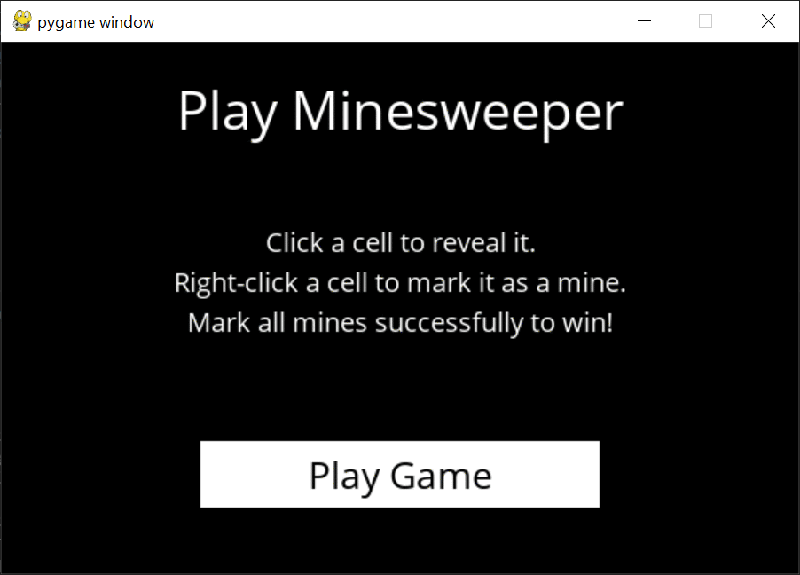

# AI assisted Minesweeper for Harvard CS50 Project 

AI assisted minesweeper using classical programming to assist in minesweeping. Built using pygame

### Instructions to run: 

- git clone https://github.com/prithvijitguha/minesweeper.git
- cd minesweeper
- pip3 install -r requirements.txt
- python runner.py 